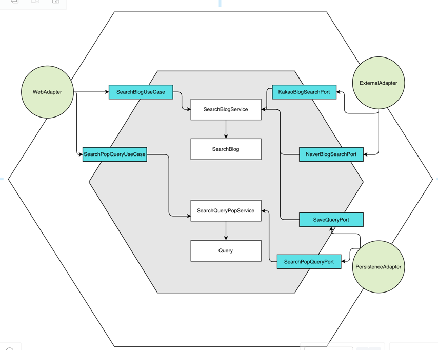

# *** 블로그 검색 프로젝트
    키워드를 통해 블로그를 검색한다
    검색결과는 정확도순, 최신순 정렬기능을 제공하며, 페이징처리하여 보여집니다.
    검색소스는 카카오 , 네이버 OpenAPI를 활용합니다.

## *** About Project

- Java 17
- Spring Boot 2.7.16
- H2 Database
- Spring Data JPA
- Gradle
- Dependencies
  - lombok
  - spring-data-jpa
  - webflux(WebClient)
  - validation(Bean validation)
  - springfox(swagger)

  

## *** 실행파일 
- [search-blog-parkminkyou-0.0.1-SNAPSHOT.jar](https://github.com/minkyou-91/search-blog/blob/main/search-blog-minkyou-0.0.1-SNAPSHOT.jar) 다운로드

  

## *** 어플리케이션 구성

  

## *** API 명세
- http://localhost:8080/swagger-ui/index.html

  

## *** 기능 요구사항 구현방법

### 1. 블로그 검색
- **키워드를 통해 블로그를 검색할 수 있어야 합니다.**
  - 파라미터 query(String)을 요청 받아 External 검색 OpenAPI 호출에 사용  
- **검색 결과에서 Sorting(정확도순, 최신순) 기능을 지원해야 합니다.**
  - 파라미터 sort value [exact(정확도순), latest(최신순)]을 요청 받아 External 검색 OpenAPI 호출에 사용
  - ExternalAdapter에서 응답받은 데이터 각 response dto로 매핑, 카카오, 네이버의 정확도순/최신순 파라미터 값으로 매핑, 정렬된 블로그 관련 정보 매핑  
- **검색 결과는 Pagination 형태로 제공해야 합니다.**
  - 요청 파라미터에서 page, size를 필수값으로 받고 페이징 정보를 응답값의 page, size, totalCount로 전달
  - 이에 사용자는 페이징 관련 인덱싱 정보와 블로그검색결과를 응답받을 수 있습니다.  
- **검색 소스는 카카오 API의 키워드로 블로그 검색을 활용합니다.**
  - WebFlux WebCLient를 활용하여 검색소스 카카오 API 연동  
- **추후 카카오 API 이외에 새로운 검색 소스가 추가될 수 있음을 고려해야 합니다.**
  - 헥사고날 아키텍처로 구성되어 있어 추가되는 검색소스가 있다면, External outport와 Adapter만 추가하여 도메인과 서비스 레이어 영향도를 최소화 할 수 있습니다.

### 2. 인기 검색어 목록
- **사용자들이 많이 검색한 순서대로, 최대 10개의 검색 키워드를 제공합니다.**
  - 블로그 검색 요청 수행을 할때마다 검색어, 검색요청횟수가 저장되는 테이블을(POPULAR_QUERY) 조회합니다.
  - JPA Query를 활용하여 POPULAR_QUERY 테이블에서 SEARCH_COUNT 값 Desc 10건 조회합니다.   
- **검색어 별로 검색된 횟수도 함께 표기해 주세요.**
  - 인기 검색어 목록 조회 응답값으로 SEARCH_COUNT 응답.

  

## *** 우대사항 추가요건
- 프로젝트 구성 추가 요건 (멀티 모듈 구성 및 모듈간 의존성 제약)
  - 향후 global 폴더를 공통 core 모듈로 분리하여 멀티모듈로 관리될 수 있도록 할 예정입니다.  

- Back-end 추가 요건 (카카오 블로그 검색 API에 장애가 발생한 경우, 네이버 블로그 검색 API를 통해 데이터 제공)
  - 네이버 검색 API 연동 구현 완료
  - 카카오 네이버 별도의 PORT와 ADAPTER를 가지므로 추후 추가되는 검색소스가 있어도 도메인과 서비스에 영향도 없음.
  - ExternalPortFactory를 @Component로 구현하여 Bean 자동 주입
  - 각 ExternalOutport에는 priority라는 값의 우선순위가 설정되며 , 우선순위에 따라 service 실행시 External Adapter로 보냅니다.
  - 이때 ExternalAdapter에서 외부 통신시 장애가 발생할 경우, Exception Catch에서 다음 ExternalOutPort로 수행되도록 하였습니다.
  - ExternalPortFactory 전체를 다 수행한 후에도 에러가 발생시 CustomException으로 throw 합니다.

  

## *** 예외 처리

- 서비스, 비즈니스의 모든 CheckedException은 CustomException으로 구현
- CustomExceptionHandler 통해 Responseentity.status.body(ErrorResponse)형태로 리턴
- ConstraintViolationException 필수파라미터 검증시 발생하는 오류도 핸들러에서 처리
- 예외 케이스 에러코드 , 메시지 등은 공통 Enum ErrorCode로 작성

 

## *** 테스트 케이스

- 통합테스트(Webadapter - 컨트롤러)
  - 검색 API
    - 성공
    - 요청 파라미터 검증 실패
  - 인기 검색어 조회 API
    - 성공
- 단위 테스트(UseCase)
  - searchBlog()
    - 성공
  - searchPopQuery()
    - 성공
- 단위 테스트(Persistence)
  - Query 최초 저장()
    - 성공
  - Query searchCount update()
    - 성공
- 단위 테스트(External)
  - sendBlogSearch()
    - 카카오 성공
    - 네이버 성공
    - 카카오 오류 발생시 네이버 테스트 -> production 코드의 카카오톡 Adapter를 수정하여 진행함
    - 테스트는 정상적으로 동작하였으나, 테스트코드 레벨에서 given으로 Webclient configure 설정을 수정하는 작업이 어려웠음.
    